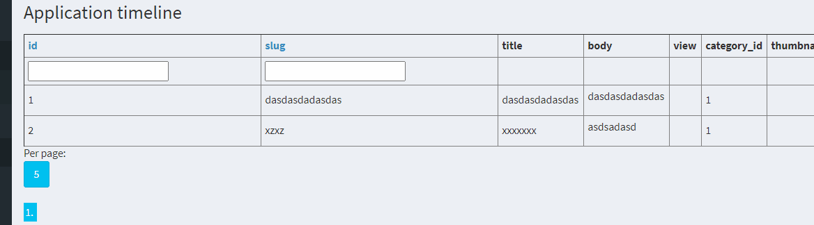

## Showcase demo




## Usage:

```
    (new \fantomx1\lightweightUntypableCombobox\lightweightUntypableCombobox())
        ->run(
                $columnName,
                [
                    '1' => 'aaa',
                    '2' => 'bbb',
                    '3' => 'ccc',
                ],
            "filter"
        );
    }
```


where the first parameter defined a name according to which group a textbox and the selectbox together
into the combobox. The second parameter is array in form of an index for an option and values to be shown as option texts.

The third parameter defines a variable name to by sent inside a form. It will have two "subfields",
[ids], and [values] = variableName[ids], variableName[values] respectivelly. As selected ids are also 
sent via a hidden textbox along the values. If it would be undesired the hidden element could be disabled
by Jquery or added parametrizable option not to use it.

## Features:
The library is self-reliant, in terms that it manages it's own assets and third party assets via
the packagesAssetsSupport library. And loads the script only once, even when being called multiple times 
or in a loop. So nothing more is needed to setup anywhere, except of calling the assets install command,
and it should work everywhere straight ahead.

